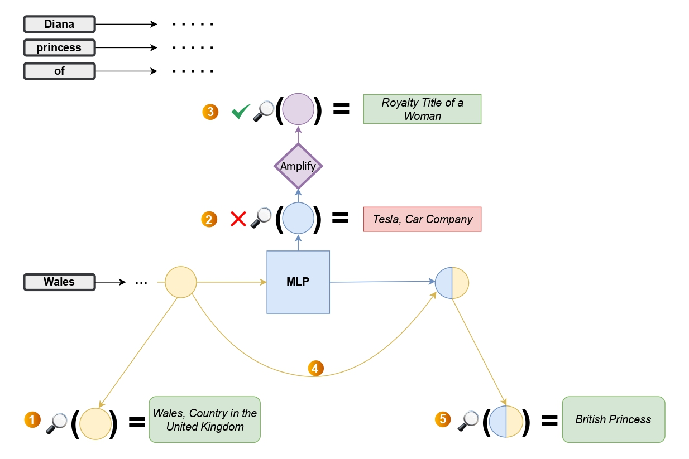

# Superscopes: Amplifying Internal Feature Representations for Language Model Interpretation

Authored by: [@GalNivs](https://x.com/GalNivs) & [@j0nathanj](https://x.com/j0nathanj)

This repository contains the code and data accompanying the paper "[Superscopes: Amplifying Internal Feature Representations for Language Model Interpretation](https://arxiv.org/abs/2503.02078)".
In this work, we introduce **Superscopes**, a technique that systematically amplifies superposed features in multilayer perceptron (MLP) outputs and hidden states before integrating them into new contexts. This approach enhances the interpretability of internal representations in large language models (LLMs) without requiring additional training, providing deeper insights into how LLMs build context and represent complex concepts.



## Contents

- **code**: Notebooks to reproduce the experiments and analyses presented in the paper.
- **data**: Datasets used for evaluating the Superscopes technique. Produced using `superscopes_mlp_outputs_full_evaluation.ipynb`.
- **superscopes_application**: Contains the necessary components to run the Superscopes application, which can be executed using the `runme.sh` script.

## Getting Started

1. **Clone the repository**:

   ``` bash
   git clone https://github.com/GalNivs/Superscopes.git
   ```

2. **Navigate to the project directory**:

   ``` bash
   cd Superscopes
   ```

3. **Install the required dependencies**:

   ``` bash
   pip install -r requirements.txt
   ```

4. **Run the experiments**:
   Run any of the `.ipynb`s using Jupyter:

   ``` python
   jupyter notebook --port==9999
   ```

5. Run the application:

   ``` bash
   ./runme.sh
   ```

   

## Citation

If you find this work useful in your research, please cite our paper:

```tex
bibtexCopyEdit@article{jacobi2025superscopes,
  title={Superscopes: Amplifying Internal Feature Representations for Language Model Interpretation},
  author={Jacobi, Jonathan and Niv, Gal},
  journal={arXiv preprint arXiv:2503.02078},
  year={2025}
}
```